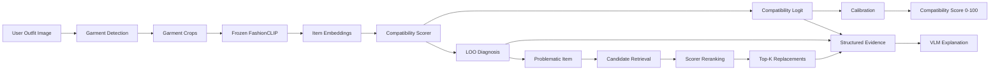

# Fashion Outfit Compatibility System

> Hệ thống đánh giá độ tương thích của một outfit, xác định item có khả năng gây mất cân bằng, gợi ý item thay thế và tạo phần giải thích dễ hiểu cho người dùng.

---

## Tổng quan

Project xây dựng một pipeline **Fashion Outfit Compatibility** theo hướng modular và architecture-neutral.

Mục tiêu chính:

- chấm **compatibility tổng thể** của một outfit;
- hỗ trợ **diagnosis** để xác định item có ảnh hưởng tiêu cực nhất;
- hỗ trợ **recommendation** để gợi ý item thay thế;
- tạo **structured evidence** cho VLM sinh phần giải thích;
- giữ pipeline đủ linh hoạt để thay đổi scorer mà không phải thay toàn bộ hệ thống.

Core scorer luôn trả về:

```text
compatibility_logit
```

Sau calibration, hệ thống có thể tạo:

```text
compatibility_score ∈ [0, 100]
```

> `compatibility_score` là score do hệ thống calibration từ model output, không phải “phần trăm đẹp” hay đánh giá thời trang khách quan.

---

## Pipeline



---

## Các thành phần chính

### 1. Data Processing

Dataset được xây dựng từ `codewaly/polyvore1000`.

Positive sample:

```text
label = 1
→ outfit gốc
```

Negative V1:

```text
label = 0
negative_type = same_category_different_kit
```

Negative được tạo bằng cách thay đúng một item với item khác:

- cùng `master_category`;
- khác `item_id`;
- đến từ kit khác;
- không tồn tại sẵn trong outfit hiện tại.

Dataset V1 giữ tỷ lệ:

```text
Positive : Negative = 1 : 1
```

Một số thống kê của preprocessing hiện tại:

| Thuộc tính | Giá trị |
|---|---:|
| Unique items | 114,806 |
| Kits | 17,316 |
| Categories | 363 |
| Positive samples | 17,316 |
| Negative samples | 17,316 |

Negative V1 hiện là **category-preserving negative**, chưa phải true style-aware hard negative.

---

### 2. FashionCLIP Embedding

Mỗi `item_id` được ánh xạ tới một embedding FashionCLIP:

```text
item_id
  ↓
Frozen FashionCLIP image encoder
  ↓
512-d embedding
  ↓
L2 normalization
```

Contract V1:

| Thuộc tính | Giá trị |
|---|---|
| Encoder | Frozen FashionCLIP |
| Dimension | 512 |
| Normalization | L2-normalized |
| Cache precision | FP16 được phép |
| Lookup key | `item_id` |

Embedding được lưu ngoài JSONL để tránh lặp dữ liệu và hỗ trợ reuse giữa các scorer.

---

### 3. Compatibility Scorer

Scorer nhận tối thiểu:

```text
item_embeddings
item_mask
```

Các architecture type-aware có thể dùng thêm:

```text
master_category_ids
coarse_category_ids
```

Output bắt buộc:

```json
{
  "compatibility_logit": 1.73
}
```

Project không khóa scorer vào một architecture cụ thể. Có thể thử nghiệm:

- Mean Pooling;
- Type-aware Pairwise;
- graph / hypergraph-based models;
- hoặc scorer khác trong tương lai.

Pairwise evidence, attention weights và item contributions là **optional diagnostics**, không phải core contract.

---

### 4. Diagnosis bằng Leave-One-Out

Diagnosis dùng Leave-One-Out để tìm item có khả năng làm giảm compatibility nhiều nhất.

Với outfit \(O\):

```text
1. Tính score gốc C(O)
2. Bỏ lần lượt từng item
3. Tính lại score
4. Tính delta
5. Rank item theo delta
```

Công thức:

\[
\Delta_i = C(O \setminus x_i) - C(O)
\]

Item có \(\Delta_i\) lớn nhất được xem là problematic item:

\[
\hat y = \arg\max_i \Delta_i
\]

Synthetic negative có `swapped_item_index`, nên diagnosis có thể được đánh giá định lượng.

---

### 5. Recommendation

Recommendation được chia thành hai stage:

```text
Problematic Item
      ↓
Candidate Retrieval
      ↓
Top-200 candidates
      ↓
Compatibility Scorer Reranking
      ↓
Top-5 replacements
```

Candidate retrieval có mục tiêu lấy shortlist với recall cao.

Scorer reranking có mục tiêu chọn candidate tạo outfit compatible hơn trong context của toàn outfit.

Recommendation là một nhánh riêng sau scorer; VLM không trực tiếp chọn candidate.

---

### 6. VLM Explanation

VLM không phải nguồn compatibility score chính.

VLM nhận structured evidence từ pipeline, ví dụ:

```json
{
  "compatibility_score": 78,
  "problem_item": {
    "category": "Shoes",
    "loo_delta": 0.18
  },
  "recommendations": [
    {
      "item_id": "candidate_001",
      "new_score": 84,
      "score_gain": 6
    }
  ]
}
```

Sau đó VLM chuyển evidence thành lời giải thích tự nhiên cho người dùng.

Mục tiêu là giữ:

```text
Scoring
≠
Explanation
```

để phần giải thích không làm thay đổi quyết định của scorer.

---

## Data Contract

Project sử dụng canonical scorer-ready JSONL.

Positive:

```json
{
  "sample_id": "214181831_pos",
  "source_kit_id": "214181831",
  "items": [
    "214181831_1",
    "214181831_2",
    "214181831_3"
  ],
  "label": 1,
  "negative_metadata": null
}
```

Negative:

```json
{
  "sample_id": "214181831_neg_1",
  "source_kit_id": "214181831",
  "items": [
    "214181831_1",
    "987654321_2",
    "214181831_3"
  ],
  "label": 0,
  "negative_metadata": {
    "negative_type": "same_category_different_kit",
    "swapped_item_index": 1,
    "original_item_id": "214181831_2",
    "replacement_item_id": "987654321_2",
    "swap_category": "example_master_category",
    "replacement_kit_id": "987654321"
  }
}
```

Các component được version độc lập:

```text
dataset_version
negative_protocol_version
category_mapping_version
embedding_version
scorer_version
calibration_version
```

---

## Evaluation

### Compatibility Scorer

Primary:

- **ROC-AUC**
- **2-way FITB**

Secondary:

- mean logit margin;
- median logit margin;
- F1-score.

### Recommendation — Retrieval

Primary:

- **Recall@200**

Secondary:

- Recall@100;
- Recall@50.

### Recommendation — Reranking

Primary:

- **Recall@5**

Secondary:

- Recall@1;
- Recall@3;
- Recall@10;
- Replacement Success Rate.

### Diagnosis

Primary:

- **LOO Top-1 Localization Accuracy**

Secondary:

- LOO Hit@2.

---

## Vì sao có nhiều metrics?

Mỗi module trả lời một câu hỏi khác nhau:

| Module | Câu hỏi chính | Metric chính |
|---|---|---|
| Scorer | Outfit compatible hay không? | ROC-AUC |
| Paired ranking | Original có tốt hơn one-item-swap negative? | 2-way FITB |
| Diagnosis | Có chỉ đúng swapped/problematic item? | LOO Top-1 |
| Retrieval | GT có lọt candidate shortlist? | Recall@200 |
| Reranking | GT có lọt shortlist cuối? | Recall@5 |

---

## Cấu trúc repository gợi ý

```text
project/
├── docs/
│   ├── DATA_CONTRACT_VI.md
│   ├── PROJECT_METRICS_VI.md
│   └── TEAM_WORKFLOW_VI.md
│
├── src/
│   ├── data/
│   ├── scorer/
│   ├── diagnosis/
│   ├── recommendation/
│   ├── detection/
│   ├── vlm/
│   └── evaluation/
│
├── configs/
├── notebooks/
│   └── experiments/
├── tests/
├── README.md
└── .gitignore
```

---

## Nguyên tắc phát triển

1. **Data Contract là source of truth** cho dữ liệu và scorer I/O.
2. Dataset V1 đã freeze thì không được âm thầm regenerate cho từng experiment.
3. Mọi scorer phải được so sánh trên cùng benchmark nếu muốn kết luận architecture tốt hơn.
4. FashionCLIP embedding được freeze và reuse giữa các experiment khi cần fair comparison.
5. Notebook dùng cho exploration; logic được chọn phải chuyển vào `src/`.
6. Artifact lớn như dataset, embedding cache và checkpoint không nên commit trực tiếp lên GitHub.
7. Raw compatibility logit không được diễn giải trực tiếp thành “phần trăm đẹp”.
8. Explanation layer phải modular và không khóa project vào một scorer cụ thể.

---

## Research Direction

Project tham khảo các hướng nghiên cứu chính trong outfit compatibility:

- **Pairwise / type-aware compatibility**: học quan hệ giữa các item thay vì chỉ aggregate feature.
- **Outfit-level modeling**: mô hình hóa outfit như một tập item thay vì sequence cố định.
- **Graph / Hypergraph modeling**: dùng category relations và high-order interactions.
- **Outlier detection / diagnosis**: xác định item làm giảm overall compatibility.
- **Complementary item retrieval**: retrieve candidate từ embedding space rồi rerank theo outfit context.
- **Vision-Language explanation**: dùng multimodal/LLM để tạo lời giải thích dựa trên evidence.

---

## Trạng thái hiện tại

Các thành phần chính đang được phát triển độc lập nhưng dùng chung Data Contract:

```text
Data Processing
Scorer
Diagnosis
Recommendation
Detection
VLM Explanation
Evaluation
```

Mục tiêu cuối cùng là một pipeline end-to-end có thể:

```text
Đánh giá outfit
      ↓
Chỉ ra item có vấn đề
      ↓
Đề xuất item thay thế
      ↓
Giải thích kết quả
```

---

## Tài liệu nội bộ

- `DATA_CONTRACT_VI.md` — source of truth cho dữ liệu, embedding, scorer I/O và versioning.
- `PROJECT_METRICS_VI.md` — định nghĩa metrics cho scorer, diagnosis và recommendation.
- `TEAM_WORKFLOW_VI.md` — workflow làm việc giữa leader và các assistants.

---

## Disclaimer

Fashion compatibility mang tính chủ quan.

Các score của hệ thống phản ánh pattern học được từ dataset và evaluation protocol hiện tại, không đại diện cho một tiêu chuẩn thời trang khách quan hay universal.
